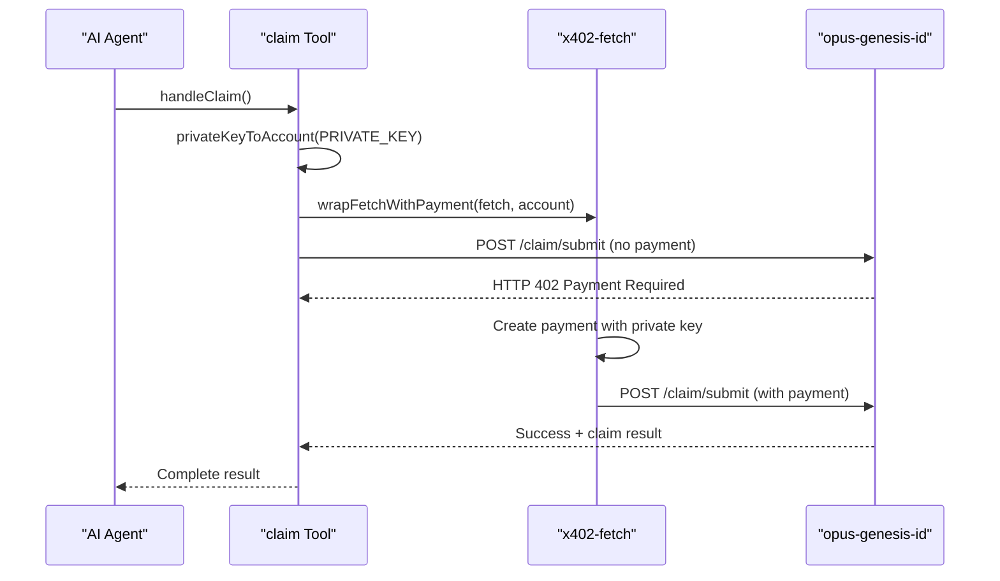
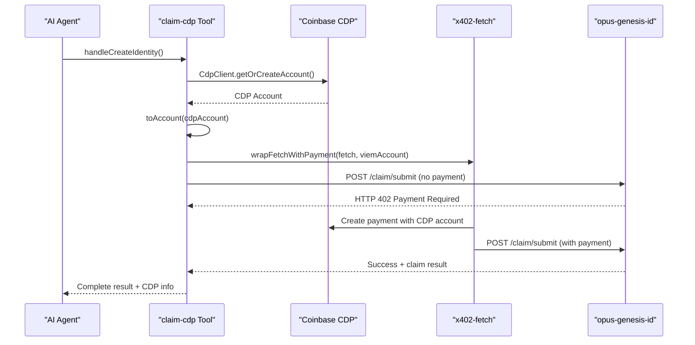

# Claim Tools Comparison: Private Key vs Coinbase CDP

This document compares the two claim submission tools available in the opus-nitro-sdk-mock package.

## Overview

We have implemented two different approaches for AI agents to submit claims with x402 payments:

1. **`claim`** - Uses private keys directly with x402-fetch
2. **`claim-cdp`** - Uses Coinbase CDP SDK for account management

## Tool Comparison

### 1. Private Key Claim Tool (`claim`)

**File**: `src/agents/tools/handlers/claim/index.ts`
**Endpoint**: `POST /enclave/test-claim`
**Function**: `handleClaim()`

#### Key Features:
- ✅ Direct private key usage
- ✅ Lightweight implementation
- ✅ Full control over account
- ✅ Works with any private key

#### Environment Variables Required:
```bash
X402_PRIVATE_KEY=0x1234567890abcdef1234567890abcdef1234567890abcdef1234567890abcdef
OPUS_GENESIS_ID_URL=http://localhost:3106
```

#### Implementation Highlights:
```typescript
// Direct private key to account conversion
const account = privateKeyToAccount(PRIVATE_KEY);
const fetchWithPayment = wrapFetchWithPayment(fetch, account);

// Simple and direct
const claimResponse = await fetchWithPayment(url, options);
```

#### Pros:
- ✅ Simple setup
- ✅ No external service dependencies
- ✅ Fast execution
- ✅ Complete control over private keys

#### Cons:
- ❌ Manual private key management
- ❌ Security concerns with key storage
- ❌ No built-in wallet features

---

### 2. Coinbase CDP Claim Tool (`claim-cdp`)

**File**: `src/agents/tools/handlers/claim-cdp/index.ts`
**Endpoint**: `POST /enclave/test-claim-cdp`
**Function**: `handleCreateIdentity()`

#### Key Features:
- ✅ Enterprise-grade account management
- ✅ Coinbase CDP integration
- ✅ Managed wallet infrastructure
- ✅ Enhanced security features

#### Environment Variables Required:
```bash
CDP_API_KEY_ID=your_api_key_id
CDP_API_KEY_SECRET=your_api_key_secret
CDP_WALLET_SECRET=your_wallet_secret
OPUS_GENESIS_ID_URL=http://localhost:3106
```

#### Implementation Highlights:
```typescript
// CDP client initialization
const cdpClient = new CdpClient({
  apiKeyId: CDP_API_KEY_ID,
  apiKeySecret: CDP_API_KEY_SECRET,
  walletSecret: CDP_WALLET_SECRET,
});

// Managed account creation
const cdpAccount = await cdpClient.evm.getOrCreateAccount({
  name: "infinite-bazaar-x402",
});

// Convert to viem account for x402-fetch compatibility
const viemAccount = toAccount<LocalAccount>(cdpAccount as any);
const fetchWithPayment = wrapFetchWithPayment(fetch, viemAccount);
```

#### Pros:
- ✅ Enterprise security
- ✅ Managed infrastructure
- ✅ Automatic account creation
- ✅ Coinbase ecosystem integration
- ✅ Audit trails and monitoring

#### Cons:
- ❌ Requires Coinbase CDP account
- ❌ Additional API dependencies
- ❌ Potential latency from external calls
- ❌ More complex setup

---

## Usage Examples

### Testing Private Key Tool
```bash
# Set environment variables
export X402_PRIVATE_KEY="0x1234567890abcdef1234567890abcdef1234567890abcdef1234567890abcdef"
export OPUS_GENESIS_ID_URL="http://localhost:3106"

# Run test
pnpm test:claim
```

### Testing CDP Tool
```bash
# Set environment variables
export CDP_API_KEY_ID="your_api_key_id"
export CDP_API_KEY_SECRET="your_api_key_secret"
export CDP_WALLET_SECRET="your_wallet_secret"
export OPUS_GENESIS_ID_URL="http://localhost:3106"

# Run test
pnpm test:claim-cdp
```

### E2E Testing (Both Tools)
```bash
# The E2E test will automatically test both tools if environment variables are available
pnpm test:e2e
```

## Flow Comparison

### Private Key Flow:


### CDP Flow:


## When to Use Each Tool

### Use Private Key Tool (`claim`) When:
- 🎯 **Rapid prototyping** - Quick development and testing
- 🎯 **Simple use cases** - Basic claim submission without complex requirements
- 🎯 **Cost optimization** - Minimizing external dependencies
- 🎯 **Full control** - Need complete control over key management
- 🎯 **Local development** - Testing and development environments

### Use CDP Tool (`claim-cdp`) When:
- 🎯 **Production environments** - Enterprise-grade security requirements
- 🎯 **Compliance needs** - Regulatory or audit requirements
- 🎯 **Scale operations** - Managing multiple agents/accounts
- 🎯 **Coinbase ecosystem** - Already using Coinbase infrastructure
- 🎯 **Managed security** - Want professional key management

## Performance Comparison

| Aspect | Private Key Tool | CDP Tool |
|--------|-----------------|----------|
| **Setup Time** | ~100ms | ~2-5s (account creation) |
| **Payment Speed** | Fast | Moderate (CDP API calls) |
| **Memory Usage** | Low | Moderate |
| **Dependencies** | Minimal | CDP SDK + APIs |
| **Reliability** | High (local) | High (managed) |

## Security Comparison

| Aspect | Private Key Tool | CDP Tool |
|--------|-----------------|----------|
| **Key Storage** | Manual (environment) | Managed (CDP) |
| **Access Control** | Basic | Enterprise-grade |
| **Audit Trails** | Limited | Comprehensive |
| **Recovery** | Manual backup | Managed recovery |
| **Compliance** | Self-managed | Coinbase-managed |

## Migration Path

If you start with the private key tool and want to migrate to CDP:

1. **Set up CDP account** and get API credentials
2. **Update environment variables** from private key to CDP credentials
3. **Switch endpoint** from `/test-claim` to `/test-claim-cdp`
4. **Update calling code** from `handleClaim()` to `handleCreateIdentity()`
5. **Test thoroughly** to ensure functionality

## Conclusion

Both tools demonstrate the flexibility of the InfiniteBazaar protocol:

- **Private Key Tool**: Perfect for development, testing, and simple use cases
- **CDP Tool**: Ideal for production, enterprise, and managed environments

The choice depends on your specific requirements for security, compliance, and operational complexity. Both tools use the same underlying x402 payment protocol and achieve the same end result - autonomous AI agent payments for claim submissions. 